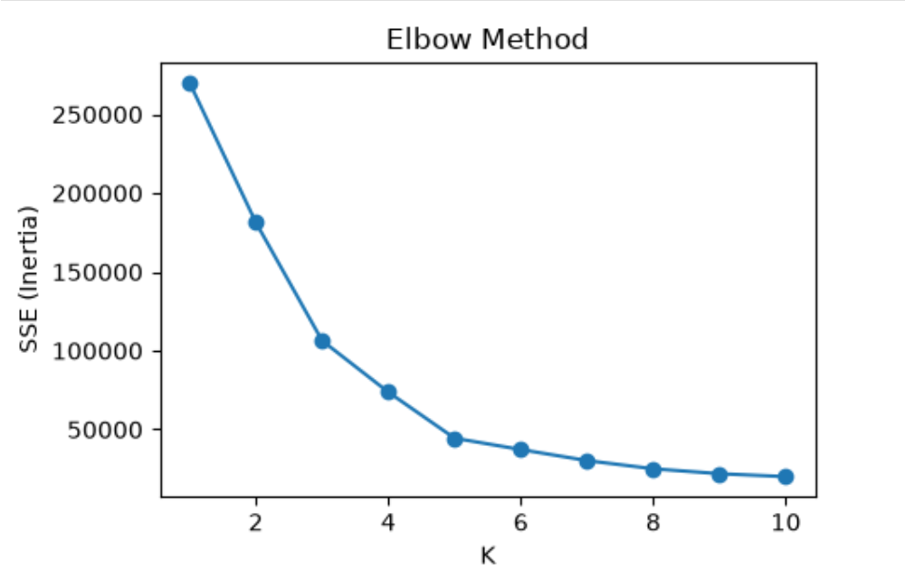

# Income & Spending Analysis Using K-Means Clustering

An unsupervised machine learning project that segments mall customers into groups based on their **Annual Income** and **Spending Score**, using K-Means Clustering built with scikit-learn.

## 📌 Overview
The project groups 200 customers into distinct segments so a business can understand different types of shoppers. It uses the Elbow Method to choose the number of clusters, then visualizes the resulting segments and their centroids.

## 🛠️ Tech Stack
- Python
- pandas, NumPy
- scikit-learn
- Matplotlib

## 📊 Dataset
- **Records:** 200 customers (Mall Customer Segmentation Data)
- **Features used:** Annual Income (k$), Spending Score (1-100)
- No target variable, since clustering is unsupervised

## ⚙️ Workflow
1. Data loading and inspection
2. Selecting Income and Spending Score as features
3. Finding the optimal K with the Elbow Method (SSE/inertia for K = 1 to 10)
4. Fitting K-Means with K = 5
5. Visualizing the clusters and centroids

## 📈 Results
K = 5 gave five clearly separated customer segments:

| Cluster | Segment |
|---|---|
| 1 | Medium income, medium spend |
| 2 | High income, high spend |
| 3 | High income, low spend |
| 4 | Low income, low spend |
| 5 | Low income, high spend |

## 🖼️ Visualizations

### Elbow Method

*SSE for K = 1 to 10, used to choose K = 5.*

### Customer Clusters (K = 5)

*Customer segments by income and spending score, with centroids marked in red.*

## 🚀 How to Run
1. Clone the repository
2. Install dependencies:
```bash
   pip install pandas numpy scikit-learn matplotlib
```
3. Place `Mall_Customers.csv` in the same folder as the notebook
4. Open `Income___Spent_Analysis_Using_K_Means_Clustering.ipynb` in Jupyter Notebook and run all cells

## 👤 Author
Nazma Begum — [GitHub](https://github.com/Nijhumtara)
